# Agentic AI and GitHub Copilot Lab

This lab is for students who are completely new to GitHub Copilot, automated tests, and agentic AI.

You will work inside a small C# project in VS Code and use Copilot to practice four useful skills:

1. Understand a codebase you have not seen before.
2. Complete a missing method.
3. Fix a real bug by using a failing test.
4. Connect Copilot to an MCP server and try one tool-using task.

You do not need prior experience with Copilot or this codebase. The lab is designed to be completed step by step.

## What is in this repository?

- `app/` contains the C# solution for the lab.
- `app/src/StoreApp/` contains the application code.
- `app/tests/StoreApp.Tests/` contains the automated tests.
- `assets/` contains prompt ideas, checkpoints, and a sample MCP configuration file.

## Before you start

Make sure you have:

- VS Code installed
- a GitHub account with access to GitHub Copilot
- the .NET SDK installed
- internet access so you can sign in to GitHub

If those terms are new, here is the short version:

- VS Code is the editor you will use for the lab.
- The .NET SDK is the toolset that builds and tests the C# code.
- GitHub Copilot is the AI assistant you will use inside VS Code.

Learn more:

- [Set up GitHub Copilot in VS Code](https://code.visualstudio.com/docs/copilot/setup)
- [GitHub Copilot overview for VS Code](https://code.visualstudio.com/docs/copilot/overview)

## Learning goals

By the end of the lab, you should be able to:

- ask Copilot to explain code in a useful way
- use tests to confirm whether code works
- make a small change with Copilot support instead of guessing
- understand the basic idea of MCP tool use

## How long this lab takes

Plan for about 60 minutes.

## Important idea before you begin

You do not need to understand every file before you start.

In real software work, developers often begin by:

1. running the tests
2. reading one small part of the code
3. making one change
4. running the tests again

That is the workflow you will practice in this lab.

## Part 0: Open the project and sign in to Copilot

If this is your first time opening VS Code, follow these steps slowly. You do not need to memorize anything yet.

1. Open VS Code.


2. If VS Code asks you to sign in, choose the GitHub sign-in option.
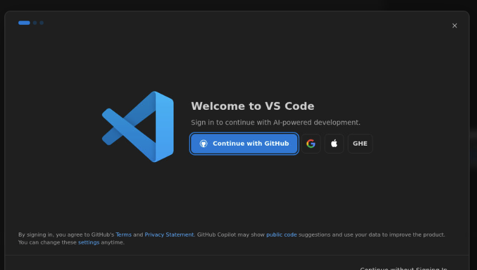

3. Enter your GitHub username and password when prompted.
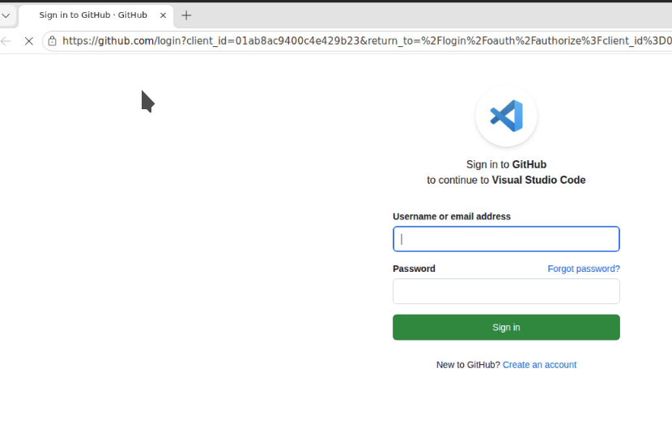

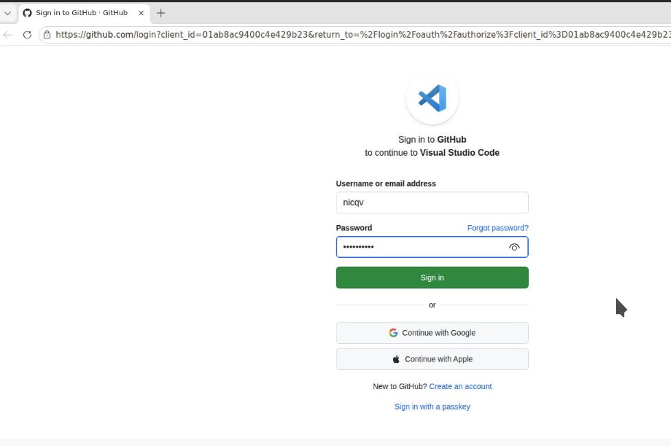

4. If GitHub asks you to verify your device, complete that step and continue.
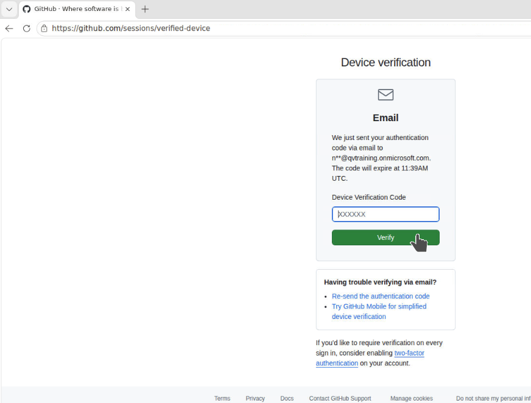

5. When asked, authorize Visual Studio Code to access your GitHub account.
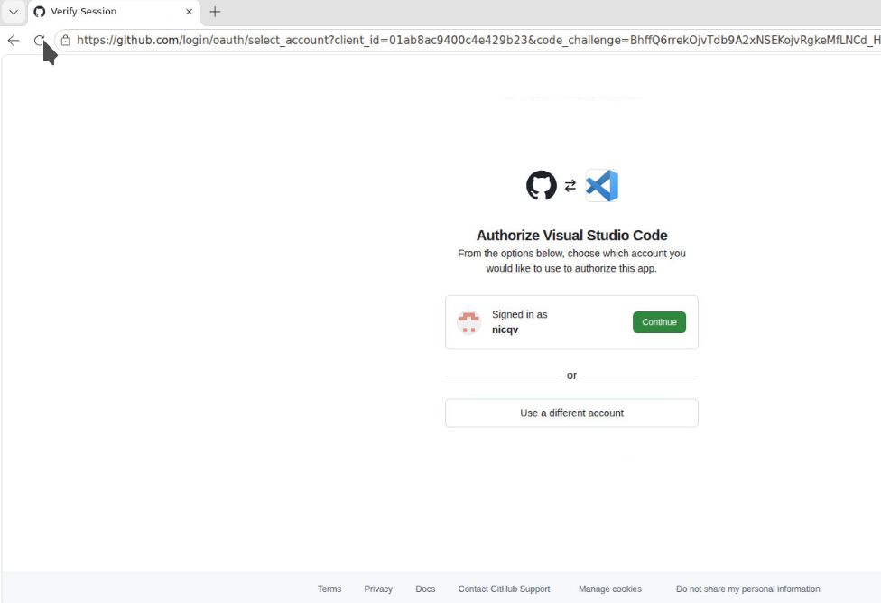

6. If you see an option such as "Always allow", it is fine to choose it for this lab.
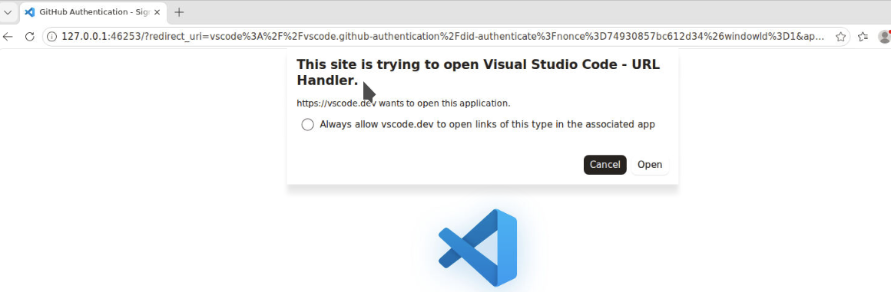

7. After the browser step finishes, return to VS Code. You may need to close the browser tab.

8. If the lab machine prompts you about encryption, choose the weaker encryption option if your instructor told you to do that for this environment.
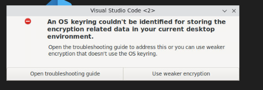

9. If VS Code asks you to choose a layout, the default layout is fine.
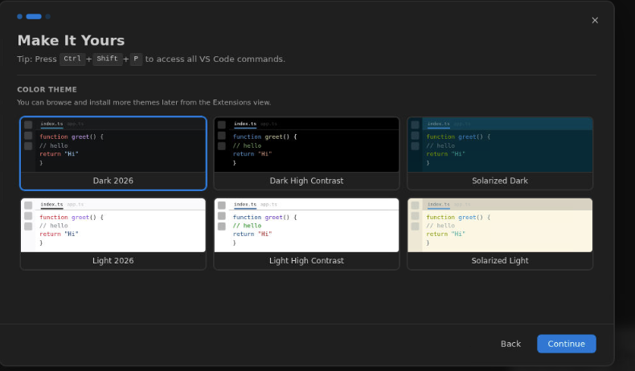

10. If you see the "Build with AI agents" screen, choose `Ask`, then select `Get Started`.

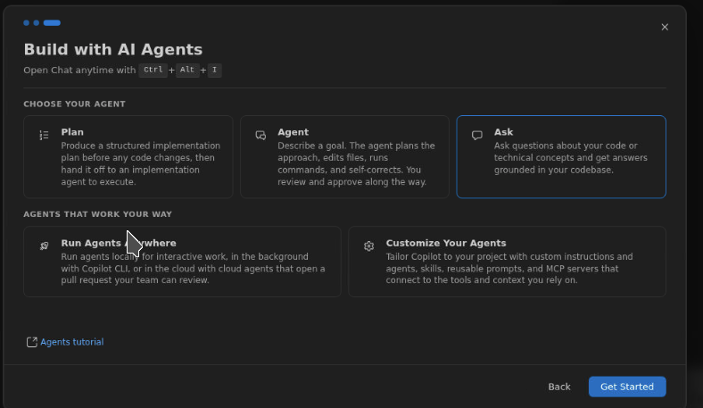

11. In VS Code, open the folder for this repository by using **File > Open Folder**.
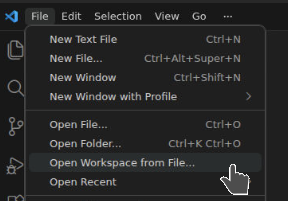

12. Select the folder that contains this repository and open it.
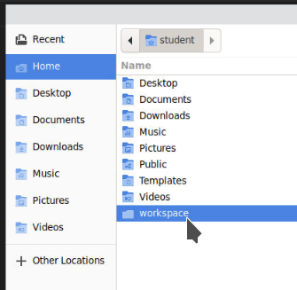

13. If VS Code asks whether you trust the authors of this folder, choose to trust the workspace.
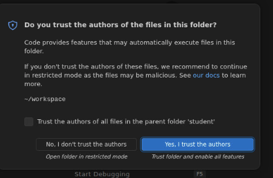

14. If VS Code suggests updating extensions, you do not need to do that for this lab. Close that window and continue.
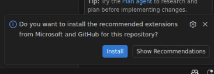

15. If you are not already signed in to GitHub inside VS Code, do this now:

   1. Open the Command Palette with `Ctrl+Shift+P`.
   2. Type `gith` to narrow the list of commands.
   3. Select `GitHub: Sign in`.
   4. Complete the sign-in steps in the browser.

   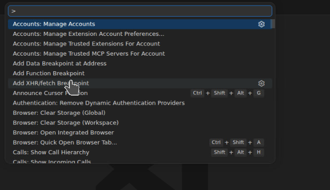

After that, make sure the GitHub Copilot extension is available in VS Code.


Learning note:

- An extension adds features to VS Code.
- GitHub Copilot appears both as inline code suggestions and as chat.
- Chat is useful when you need an explanation or a plan. Inline suggestions are faster when you already know roughly what you want to write.

Learn more:

- [Get started with GitHub Copilot Chat in VS Code](https://code.visualstudio.com/docs/copilot/getting-started-chat)
- [Get started with GitHub Copilot for Azure in VS Code](https://learn.microsoft.com/azure/developer/github-copilot-azure/get-started)

## Part 1: Run the project and the baseline tests

This step confirms that the project is in the expected starting state.

1. Open a terminal in VS Code.
   If you are not sure how to do that, choose **Terminal > New Terminal** from the top menu.
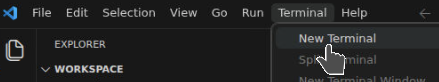

2. Run these commands:

```powershell
cd app
dotnet test
```

`dotnet test` may take a few minutes the first time you run it. That is normal because .NET may need to restore packages and build the project first.

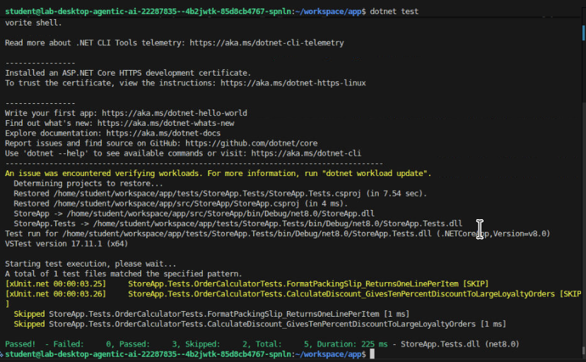


What you should see:

- the solution builds successfully
- 3 tests pass
- 2 tests are skipped

Learning note:

- A test is a small program that checks whether your code behaves as expected.
- A passing test means the checked behavior currently works.
- A skipped test is a test that exists, but is intentionally not being run yet.
- In this lab, skipped tests are used to reveal the next exercise at the right time.

If your result looks very different, pause and fix that before moving on.

You can compare your output with the checkpoint notes in `assets/checkpoints.md`.

Learn more:

- [Tutorial: Test a .NET class library using Visual Studio Code](https://learn.microsoft.com/dotnet/core/tutorials/testing-library-with-visual-studio-code)

## Part 2: Use Copilot to understand the codebase

In this part, you will use Copilot Chat to explore the project.

Learning note:

- When you ask Copilot to explain code, shorter and more specific prompts usually work better than broad prompts.
- `@workspace` tells Copilot to use the whole repository as context.
- `#editor` tells Copilot to focus on the file that is currently open.
- Good developers do not try to understand every file at once. They start with the file that makes the next decision easier.

### Step 2.1: Ask for a project summary

Open Copilot Chat and paste this prompt:

```text
@workspace Describe this project in simple language. Tell me what each main folder is for and which file I should read first as a beginner.
```

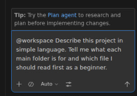

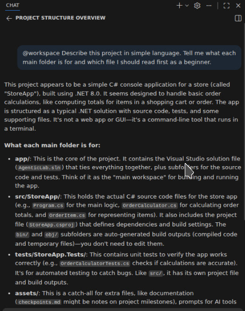


### Step 2.2: Read the main code file

Open this file:

- `app/src/StoreApp/OrderCalculator.cs`

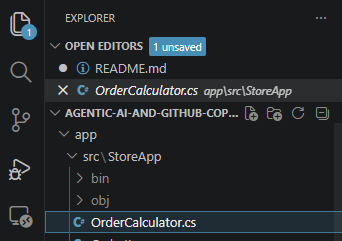

Then ask Copilot:

```text
#editor Explain this file for a beginner. What does each method do, and which method is intentionally unfinished?
```
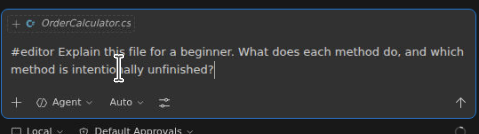

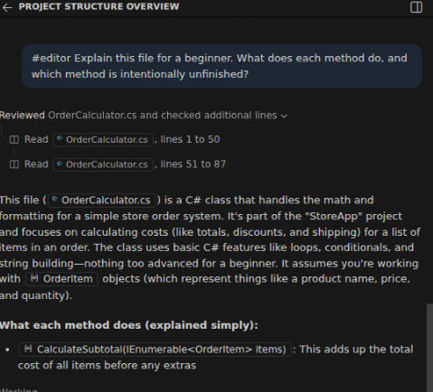


### Step 2.3: Inspect the tests

Open this file:

- `app/tests/StoreApp.Tests/OrderCalculatorTests.cs`

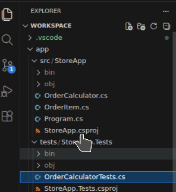


Ask Copilot:

```text
#editor Explain these tests in plain English. Which tests already pass, and which tests are skipped on purpose for the lab?
```

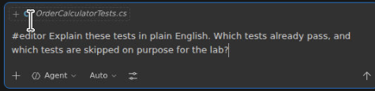

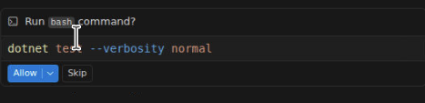

When Copilot wants to run a command or use a tool, pause and read what it is asking to do.
For this lab, that is a good habit. You are practicing a step-by-step workflow where you stay in control, review suggestions, and decide what to do next.

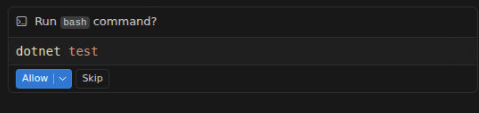

You may also see an autopilot-style option where Copilot can take more actions on its own.
That can be useful later, but for beginners it is usually better to stay hands-on and review each step.

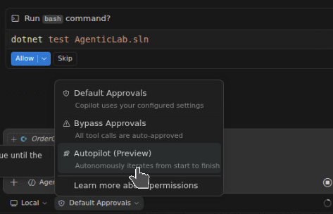

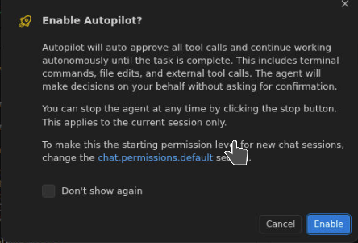

If you choose the more automated path, Copilot may decide the next steps for you.
That can be faster, but it is usually not the best way to learn the workflow for this lab.

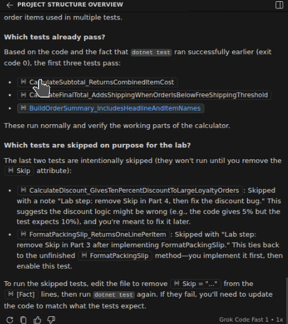


Why this matters:

- the tests tell you what the code is supposed to do
- skipped tests are clues for the next lab steps

Extra learning:

- Production code is the code the application runs.
- Test code describes and checks the expected behavior of the production code.
- Reading tests is often the fastest way to understand what a method should return.

If you want a copy/paste prompt sheet, use `assets/copilot-prompts.md`.

Learn more:

- [GitHub Copilot overview for VS Code](https://code.visualstudio.com/docs/copilot/overview)

## Part 3: Implement the missing method

Now you will complete the unfinished method.

Open this file:

- `app/src/StoreApp/OrderCalculator.cs`

Find this method:

- `FormatPackingSlip`

Right now, it throws a `NotImplementedException`. That means the method exists, but it does not do any real work yet.

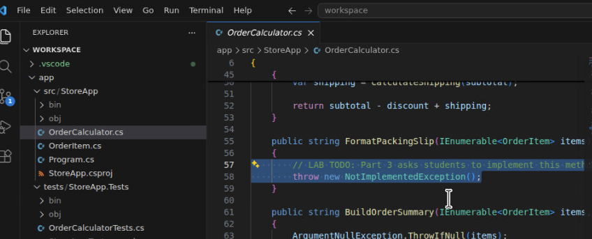


Learning note:

- A stub is a placeholder method that has not been finished.
- `NotImplementedException` is often used to mark code that still needs to be written.
- This is a good exercise target because the code compiles, but one behavior is still missing.

### Step 3.1: Turn on the related test

Open `app/tests/StoreApp.Tests/OrderCalculatorTests.cs`.

Find this test:

- `FormatPackingSlip_ReturnsOneLinePerItem`

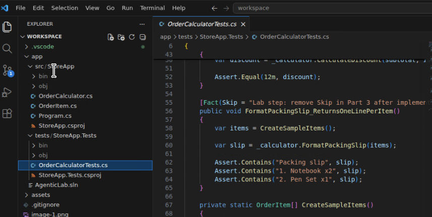


Remove the `Skip = ...` part from the `[Fact]` attribute for that test so the test can run.


It should change from this:

```csharp
[Fact(Skip = "Lab step: remove Skip in Part 3 after implementing FormatPackingSlip.")]
```

to this:

```csharp
[Fact]
```
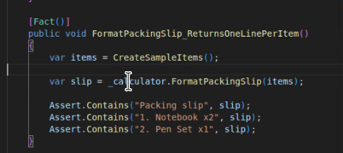


### Step 3.2: Run only that test

Run:

```powershell
dotnet test --filter FormatPackingSlip
```
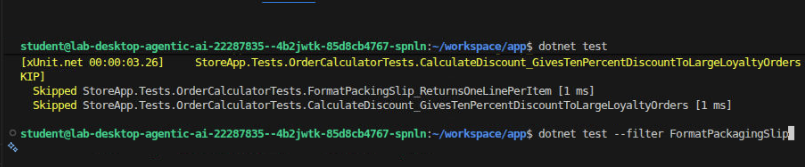


It should fail. That is expected.


Why failure is useful:

- A failing test gives you a precise target.
- Instead of guessing what to code, you can implement only the behavior the test asks for.
- This is part of a common workflow: fail first, then implement, then verify.

### Step 3.3: Ask Copilot for help

Place your cursor inside `FormatPackingSlip` and try one of these approaches.

Preferred approach:

- start typing the code yourself
- accept Copilot completions with `Tab`

If you get stuck, use this prompt:

```text
#selection Implement this method so it returns a packing slip string with a title and numbered lines for each item. Keep the output deterministic and handle null input.
```

What to watch for in the answer:

- Does the suggested code handle `null` input?
- Does it create predictable output in the same order every time?
- Does it match the wording expected by the test?

Learning note:

- Deterministic output means the same input always produces the same output.
- Deterministic code is easier to test because the result is predictable.

### Step 3.4: Re-run the test

Run:

```powershell
dotnet test --filter FormatPackingSlip
```

Keep going until that test passes.

Then run the full suite again:

```powershell
dotnet test
```

Expected result now:

- 4 tests pass
- 1 test is still skipped

Learn more:

- [Tutorial: Test a .NET class library using Visual Studio Code](https://learn.microsoft.com/dotnet/core/tutorials/testing-library-with-visual-studio-code#debug-tests)

## Part 4: Find and fix a bug with a test

Now you will use a test to expose a bug.

Learning note:

- A bug is simply behavior that does not match the expected result.
- The test name is often a strong clue about the intended business rule.
- Your goal is not to rewrite the whole method. Your goal is to make the smallest safe change that fixes the specific behavior.

Open `app/tests/StoreApp.Tests/OrderCalculatorTests.cs` again.

Find this test:

- `CalculateDiscount_GivesTenPercentDiscountToLargeLoyaltyOrders`

This test is also skipped on purpose.

### Step 4.1: Turn on the bug-finding test

Change the attribute from:

```csharp
[Fact(Skip = "Lab step: remove Skip in Part 4, then fix the discount bug.")]
```

to:

```csharp
[Fact]
```

### Step 4.2: Run only the discount test

Run:

```powershell
dotnet test --filter CalculateDiscount
```

It should fail.

This is the moment where the test becomes evidence. The failure message tells you what the code did, what the test expected, and which behavior needs attention.

### Step 4.3: Investigate the failure

Open `app/src/StoreApp/OrderCalculator.cs` and look at `CalculateDiscount`.

Ask Copilot:

```text
I have a failing test named CalculateDiscount_GivesTenPercentDiscountToLargeLoyaltyOrders. Look at the current CalculateDiscount method and suggest the smallest code change needed to make the test pass.
```

### Step 4.4: Fix the bug

Apply the smallest fix you can.

Tip: the test name tells you exactly what behavior is expected.

Useful debugging habit:

1. Read the test name.
2. Read the expected value.
3. Read the actual value.
4. Open only the method most directly responsible.
5. Change one thing.
6. Re-run the same test.

### Step 4.5: Confirm the fix

Run:

```powershell
dotnet test --filter CalculateDiscount
dotnet test
```

Expected result now:

- all 5 tests pass

Learn more:

- [Tutorial: Debug a .NET console application in VS Code](https://learn.microsoft.com/dotnet/core/tutorials/debug-console-app)

## Part 5: Do a safe refactor

Refactoring means improving the code without changing what it does.

Learning note:

- Refactoring improves structure, naming, clarity, or duplication.
- Refactoring should not change the public behavior that users and tests depend on.
- Tests are your safety net when refactoring.

You will refactor this method:

- `BuildOrderSummary`

in `app/src/StoreApp/OrderCalculator.cs`

### Step 5.1: Ask for a small refactor

Select the method body and use this prompt:

```text
#selection Refactor this method to improve readability without changing behavior. Keep it beginner-friendly and avoid unnecessary complexity.
```

### Step 5.2: Review the suggestion before accepting it

Check for these things:

- Are variable names still clear?
- Is the code shorter or easier to follow?
- Did Copilot change behavior, or just structure?

Good rule:

- If a refactor makes the code harder to explain, it is probably not a good beginner-friendly refactor.

### Step 5.3: Run the tests again

Run:

```powershell
dotnet test
```

If the tests still pass, your refactor preserved behavior.

Learn more:

- [Tutorial: Test a .NET class library using Visual Studio Code](https://learn.microsoft.com/dotnet/core/tutorials/testing-library-with-visual-studio-code)

## Part 6: Try one agentic AI task with MCP

This part introduces the idea of tools.

Copilot on its own can answer questions from the editor context.
With MCP, Copilot can call approved tools to fetch extra information.

Examples of tool actions include:

- reading a file
- searching a codebase
- returning instructions from a lab server

Learning note:

- MCP stands for Model Context Protocol.
- It is a standard way for tools and AI assistants to work together.
- In simple terms, MCP lets Copilot ask approved tools for extra context instead of guessing.
- This is one of the main differences between a simple chat assistant and a more agentic workflow.

### Step 6.1: Use the sample MCP config

Open this file:

- `assets/mcp-server.sample.json`

Your instructor can give you:

- the real server URL
- the API key or other authentication value
- the exact place in VS Code where this JSON should be added

Replace the placeholder values with the real ones.

What this config does:

- it gives VS Code a named MCP server connection
- it tells VS Code where the server lives
- it optionally provides authentication headers so the server accepts requests

### Step 6.2: Ask Copilot to use tools

Once MCP is connected, try this prompt:

```text
Use the available tools to find the method that calculates discounts in this lab, explain how it works, and tell me the safest place to change the discount rule.
```

### Step 6.3: Observe the difference

Notice the difference between:

- a normal Copilot answer based only on open files and workspace context
- a tool-using answer that fetches extra context through MCP

That tool-use loop is the core idea behind agentic AI in this lab.

Learn more:

- [Use an MCP tool in Visual Studio Code](https://learn.microsoft.com/azure/sentinel/datalake/sentinel-mcp-use-tool-visual-studio-code)
- [Connect an MCP server from Visual Studio Code](https://learn.microsoft.com/azure/app-service/configure-authentication-mcp-server-vscode#connect-from-visual-studio-code)

## Common problems and what to do

### `dotnet` does not work

If the terminal says `dotnet` is not recognized, the .NET SDK is not installed or not on your path.

### Copilot Chat is missing

Make sure:

- you are signed in to GitHub in VS Code
- the GitHub Copilot extension is installed
- your account can use Copilot

### A test keeps failing

When a test fails:

1. read the test name
2. read the assertion message
3. inspect only the method related to that test
4. make one small change
5. run the test again

Do not change multiple methods at once unless you have a very clear reason.

If you are stuck, you can also set a breakpoint and step through the code while the test runs.

Learn more:

- [Debug tests in Visual Studio Code](https://learn.microsoft.com/dotnet/core/tutorials/testing-library-with-visual-studio-code#debug-tests)

### MCP does not connect

If the MCP step fails, do not block the rest of the lab. Continue with the code tasks and ask your instructor to demonstrate the MCP connection.

## Files you will probably open during the lab

- `app/src/StoreApp/OrderCalculator.cs`
- `app/src/StoreApp/OrderItem.cs`
- `app/tests/StoreApp.Tests/OrderCalculatorTests.cs`
- `assets/copilot-prompts.md`
- `assets/checkpoints.md`
- `assets/mcp-server.sample.json`

## Suggested chat budget

For this lab, you should assume you are using GitHub Copilot on a GitHub Free account.

Why this matters:

- GitHub Free accounts have more limited Copilot usage than paid plans.
- If you use too many chat prompts early, you may run out before the lab is finished.
- Repeated back-and-forth prompt chains are the fastest way to burn through the available usage.
- This lab is designed to teach a disciplined workflow, not just how to ask more questions.

At the time this lab was prepared, Pro and Pro+ accounts were not available to create for this scenario and should be treated as unavailable for planning purposes. Assume that upgrade paths are on indefinite hold and that the exercises must work well for Free accounts.

That is why we care about prompt count.

The goal is not to avoid Copilot. The goal is to use it at the points where it adds the most value:

- use chat when you need explanation, direction, or debugging help
- use inline completions when you already know roughly what code you want to write
- use tests and the debugger as evidence instead of asking the same question in several different ways

Why we need to worry about how many prompts you use:

- each prompt is part of a limited budget
- long debugging conversations can consume that budget quickly
- students in a shared lab need a reliable path that does not depend on unlimited AI usage
- good engineers should be able to combine AI help, tests, reading, and debugging instead of relying on chat alone

A good target is:

- 2 to understand the project
- 1 to implement the missing method
- 1 to investigate the bug
- 1 to suggest a refactor
- 1 for the MCP task

That keeps the whole lab efficient and leaves some room for one or two recovery prompts if you get stuck.

Good ways to stay within budget:

1. Read the test before asking Copilot to fix the code.
2. Ask one focused question instead of three broad ones.
3. Try `Tab` completions before opening a new chat thread.
4. Re-run the test after each small change instead of asking Copilot what to try next.
5. If you are stuck after two attempts, ask your instructor rather than spending the rest of your prompt budget.

## Lab complete checklist

You have finished the lab when:

- `FormatPackingSlip` is implemented
- the discount bug is fixed
- all tests pass
- you completed one refactor
- you tried one MCP-based prompt or watched the instructor demo it

## Optional advanced tasks

These tasks are optional stretch goals.

Do not start them until you have completed the main lab.

They are more advanced than the core lab, but they still use a step-by-step format.

### Optional task 1: Add stronger input validation

Improve the code so it handles invalid data more safely.

Possible rules:

- reject items with a blank name
- reject negative prices
- reject zero or negative quantities

Steps:

1. Open `app/tests/StoreApp.Tests/OrderCalculatorTests.cs`.
2. Add one new test for a blank item name.
3. Add one new test for a negative price.
4. Add one new test for a zero or negative quantity.
5. Run `dotnet test` and confirm the new tests fail.
6. Open `app/src/StoreApp/OrderCalculator.cs` and decide where the validation should happen.
7. Add the validation logic.
8. Run `dotnet test` again and confirm all tests pass.

Why this is more advanced:

- you need to decide where validation belongs
- you need to choose the right exception type or failure behavior
- you must avoid breaking existing tests unnecessarily

### Optional task 2: Add tiered discount rules

Change the discount logic to support more than one discount level.

Example rule set:

- loyalty members get 5% off orders from `$100` to `$199.99`
- loyalty members get 10% off orders from `$200` and above

Steps:

1. Open `app/tests/StoreApp.Tests/OrderCalculatorTests.cs`.
2. Add a test for a loyalty order just above `$100`.
3. Add a test for a loyalty order at `$200` or above.
4. Add a boundary test for a value close to the threshold, such as `$199.99`.
5. Run `dotnet test` and confirm the new tests fail.
6. Open `app/src/StoreApp/OrderCalculator.cs`.
7. Update `CalculateDiscount` to support the new tiers.
8. If the method becomes hard to read, refactor it before you finish.
9. Run `dotnet test` and confirm all tests pass.

Why this is more advanced:

- business rules become more complex
- the method can become harder to read if you only patch conditions into place
- you must keep behavior correct at the boundary values

### Optional task 3: Add test coverage for edge cases

Design tests for cases the current suite does not cover.

Possible edge cases:

- an empty order
- a subtotal exactly on the free shipping threshold
- a subtotal exactly on the discount threshold
- a single item with quantity `1`

Steps:

1. Open `app/tests/StoreApp.Tests/OrderCalculatorTests.cs`.
2. Pick two or more edge cases from the list above.
3. Add tests that describe the expected behavior for those cases.
4. Run `dotnet test`.
5. If a test fails, decide whether the code is wrong or whether your expected behavior needs to be adjusted.
6. Make the smallest safe code change needed.
7. Run `dotnet test` again and confirm everything passes.

Why this is more advanced:

- you must think like a tester, not just an implementer
- edge cases often reveal hidden bugs in otherwise "working" code

### Optional task 4: Refactor toward a cleaner design

Refactor `OrderCalculator` so responsibilities are more clearly separated.

Possible directions:

- extract summary formatting into a separate helper or service
- separate pricing rules from string formatting rules
- reduce repeated subtotal, discount, and shipping calculations

Rules for this task:

- keep public behavior the same unless your tests intentionally change it
- keep the code easier to explain, not just more abstract
- run all tests after each refactor step

Steps:

1. Open `app/src/StoreApp/OrderCalculator.cs`.
2. Pick one small cleanup target, such as repeated pricing calculations or formatting logic.
3. Make one refactor change only.
4. Run `dotnet test`.
5. If tests still pass, make one more small refactor.
6. Repeat until the design is cleaner or until the next refactor would add unnecessary complexity.
7. Stop and review whether the code is now easier to explain than before.

Why this is more advanced:

- you are making design decisions, not just editing a single method
- over-refactoring can make simple code worse, so judgment matters

### Optional task 5: Debug through a failing test

Pick one test, place a breakpoint in the related production method, and run the test under the debugger.

Steps:

1. Open `app/tests/StoreApp.Tests/OrderCalculatorTests.cs` and choose one test to investigate.
2. Open the related method in `app/src/StoreApp/OrderCalculator.cs`.
3. Set a breakpoint in that method.
4. Run the chosen test under the debugger.
5. Observe the input values that reach the method.
6. Step through the method line by line.
7. Record which branch the code follows and which values are produced.
8. Compare what you observed with what the test expected.

Your goal is to observe:

- the input values passed into the method
- which branches of the code run
- which values lead to the final assertion

Why this is more advanced:

- it builds the habit of using the debugger as evidence rather than guessing from code alone

Learn more:

- [Debug tests in Visual Studio Code](https://learn.microsoft.com/dotnet/core/tutorials/testing-library-with-visual-studio-code#debug-tests)
- [Tutorial: Debug a .NET console application in VS Code](https://learn.microsoft.com/dotnet/core/tutorials/debug-console-app)

### Optional task 6: Use MCP for a deeper code investigation

If your MCP server is connected and supports useful read-only tools, try a more advanced agentic prompt.

Steps:

1. Confirm that your MCP server is connected.
2. Open Copilot Chat.
3. Paste the prompt below.
4. Watch which tools are called.
5. Read the final answer and compare it with the code and tests in the repo.
6. Decide whether the answer is grounded in evidence or whether it made unsupported assumptions.
7. If useful, ask one follow-up question focused on a single edge case or one proposed rule change.

Example prompt:

```text
Use the available tools to inspect the pricing-related code and tests in this lab. Summarize the current pricing rules, identify untested edge cases, and propose the smallest safe change to support a new VIP discount rule.
```

What to evaluate in the response:

- Did the tool calls gather useful evidence?
- Did the answer separate facts from suggestions?
- Did it identify risks before proposing code changes?

Why this is more advanced:

- you are asking the agent not just to explain code, but to analyze the system and propose a controlled change

### Optional task 7: Add a new output format

Extend the application so it can produce a second type of output in addition to the existing summary.

Possible formats:

- a customer receipt view
- a plain-text export for email
- a compact one-line summary for logs

Steps:

1. Choose one new output format from the list above.
2. Open `app/tests/StoreApp.Tests/OrderCalculatorTests.cs`.
3. Add one or more tests that define exactly what the new output should look like.
4. Run `dotnet test` and confirm the new tests fail.
5. Decide whether to add the new behavior to `OrderCalculator` or move formatting into a separate class.
6. Implement the new output format.
7. Run `dotnet test` again and confirm all tests pass.
8. Review the final code and check whether duplication stayed low.

Why this is more advanced:

- it forces you to think about design, naming, and separation of concerns
- it is easy to create formatting code that works but is hard to maintain

## Extra practice if you finish early

Try one of these:

1. Add a test for invalid input to `FormatPackingSlip`.
2. Ask Copilot to suggest a better name for one method and explain why.
3. Add a new summary line to `BuildOrderSummary`, then update tests to match.

## Support files

These files are included to make the lab easier to follow:

- `assets/copilot-prompts.md` contains the prompt pack.
- `assets/checkpoints.md` shows expected progress at each stage.
- `assets/mcp-server.sample.json` gives you a starter MCP configuration.
